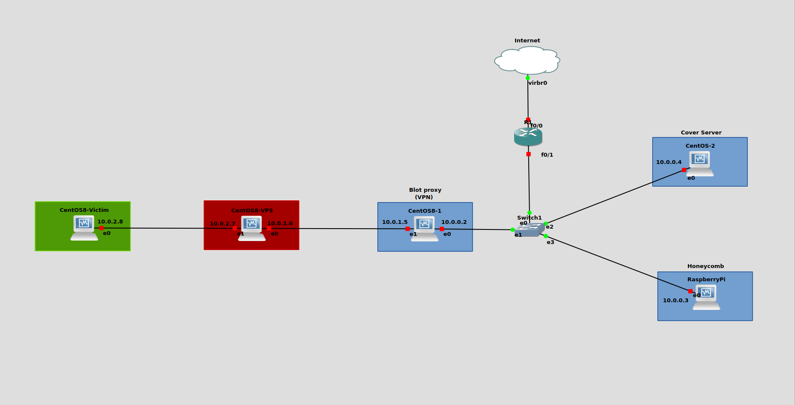

# WikiLeaks-Hive
The CIA Hive Component, Network Security Project - Università della Calabria
 (<b>in progress</b>)

 Documents source: https://wikileaks.org/vault7/document/#hive . 
Tools code source: https://wikileaks.org//vault8/document/repo_hive/ . 

For the project:
1) we used GNS3 (download from here if you don't have it https://gns3.com/software/download) 
2) (damn github space) here Raspberry, CentOS 9 and CentOS 8 vdi https://drive.google.com/drive/folders/1iMBmSrFLrXflvCLyclsWiBR0eFZDcFVp?usp=sharing . 
3) follow the 'Set up VMachines' pdf file in the repo to set up VMs 

Structure:

 Exam presentation (brief explenation of Hive) in the pptx file. 
