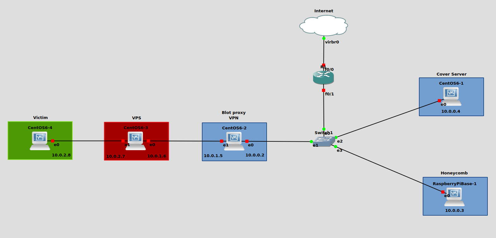

# WikiLeaks-Hive 
The CIA Hive Component, Network Security Project - Università della Calabria
 (<b>in progress</b>)

Documents source: https://wikileaks.org/vault7/document/#hive . 
Tools code source: https://wikileaks.org//vault8/document/repo_hive/ .

<I>NOTE: we were unable to configure everything due to issues with CentOS versions and missing/deprecated commands</I> 

For the project:
1) we used GNS3 (download from here if you don't have it https://gns3.com/software/download) 
2) (damn github space) here Raspberry and CentOS6 vdi https://drive.google.com/drive/folders/1iMBmSrFLrXflvCLyclsWiBR0eFZDcFVp?usp=sharing . 
3) follow the 'Set up VMachines' pdf file in the repo to set up VMs 

Structure:

Exam presentation <a href="https://github.com/giadagabriele/WikiLeaks-Hive/blob/main/The%20CIA%20Hive%20component.pptx">here</a>. 
